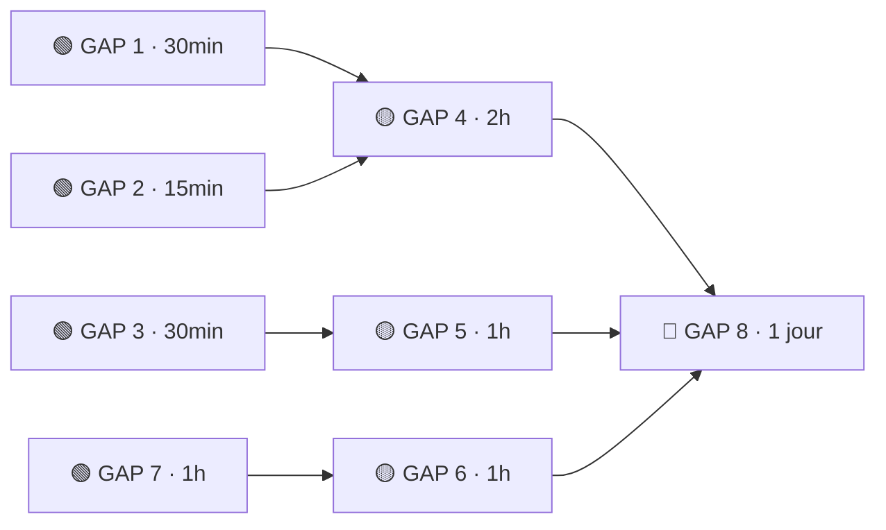
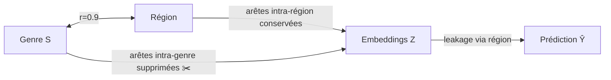

# 06 — Gaps & Plans d'Amélioration

> [!abstract] Objectif
> Cette note recense de façon exhaustive les **lacunes analytiques** identifiées dans l'analyse du projet Pokec Fairness GNN, et propose pour chacune un **plan d'implémentation concret** avec estimation de complexité. Les gaps sont priorisés selon la règle *Easy Wins First*.

## Liens vers les autres notes

| Note | Contenu |
|------|---------|
| [[02 - Résultats Fairness]] | Résultats comparatifs, ΔDP, leakage par méthode |
| [[03 - Biais Structurel & Leakage]] | Biais structurel, corrélation genre–région, RB |
| [[04 - Interprétabilité GNNExplainer]] | GNNExplainer, analyse des sous-graphes explicatifs |
| [[05 - Robustesse]] | Perturbations de graphe, stabilité des métriques |

---

## Tableau Récapitulatif

| # | Gap | Impact | Complexité | Statut |
|---|-----|--------|------------|--------|
| GAP 1 | Leakage FairGNN non mesuré | Haut | 🟢 EASY (30 min) | ✅ DONE — 0,8586 (leakage > baseline !) |
| GAP 2 | Leakage Resampling non mesuré | Haut | 🟢 EASY (15 min) | ✅ DONE — 0,8163 (≈ baseline) |
| GAP 3 | CF scores Resampling & FairGNN non mesurés | Moyen | 🟢 EASY (30 min) | ✅ DONE — RS=0,012 FairGNN=0,014 |
| GAP PT | Post-traitement (calibration de seuils) absent | Haut | 🟢 EASY (2h) | ✅ DONE — post-DP: ΔDP=0,007 (−84%), F1=0,937 |
| GAP HP | num_layers impact sur le biais structurel | Moyen | 🟢 EASY (1h) | ⬜ TODO |
| GAP 7 | Robustesse des métriques de fairness | Moyen | 🟢 EASY (1h) | ⬜ TODO |
| GAP 4 | Paradoxe FairDrop : leakage ↑ quand ΔDP ↓ | Critique | 🟡 MEDIUM (2h) | ⬜ TODO |
| GAP 5 | FairGNN non-monotonicité à λ=5.0 | Moyen | 🟡 MEDIUM (1h) | ⬜ TODO |
| GAP 6 | GNNExplainer sur 5 nœuds seulement | Moyen | 🟡 MEDIUM (1h) | ⬜ TODO |
| GAP 8 | Solutions au leakage structurel | Critique | 🔴 HARD (1 jour) | ⬜ TODO |

---

## Priorisation : Easy Wins d'abord



> [!tip] Stratégie recommandée
> Commencer par les 4 easy wins (GAP 1, 2, 3, 7) — **~2h30 au total** — pour compléter le tableau comparatif. Ensuite aborder les MEDIUM pour approfondir les paradoxes. Le GAP 8 est optionnel (recherche avancée).

---

## 🟢 GAP 1 — Leakage FairGNN non mesuré

> [!WARNING] Gap critique sur l'objectif principal
> FairGNN est conçu spécifiquement pour **réduire le biais de représentation** via l'adversarial training. Ne pas mesurer le leakage sur FairGNN, c'est ne pas évaluer l'objectif même de la méthode.

### Problème précis

On sait que FairGNN réduit **ΔDP de 67%** (de 0.0418 à 0.0137 à λ=1.0), mais aucune mesure de `sensitive_leakage(emb_fairgnn)` n'a été réalisée. Or le leakage (RB — Representation Bias) mesure à quel point un classifieur peut prédire l'attribut sensible *S* à partir des embeddings *Z* :

$$RB(Z, S) = \text{AUC}(\hat{S} \leftarrow Z)$$

Si FairGNN fait bien son travail, on devrait observer **RB < 0.817** (valeur baseline). Si RB reste élevé malgré ΔDP faible, cela révèle une dissociation entre équité de prédiction et équité de représentation — résultat théoriquement intéressant.

### Evidence from data

| Méthode | ΔDP | Leakage RB |
|---------|-----|------------|
| Baseline | 0.0418 | 0.817 |
| Resampling | ? | **non mesuré** |
| FairDrop (p=0.5) | 0.038 | 0.878 ⚠️ |
| FairGNN (λ=1.0) | 0.0137 | **non mesuré** |

### Explication théorique

L'adversarial training de FairGNN minimise :

$$\mathcal{L} = \mathcal{L}_{task} - \lambda \cdot \mathcal{L}_{adv}$$

Le terme $-\lambda \cdot \mathcal{L}_{adv}$ pénalise l'encodeur si l'adversaire parvient à prédire *S* à partir de *Z*. En théorie, cela devrait directement réduire RB. La validation empirique est manquante.

> [!TODO] Plan d'implémentation — GAP 1
> **Fichier** : `notebooks/fairness_analysis.ipynb`, cellule FairGNN
>
> ```python
> # Après l'entraînement FairGNN, récupérer les embeddings
> emb_fairgnn = model_fairgnn.get_embeddings(data)
>
> # Mesurer le leakage (identique à ce qui existe déjà pour baseline)
> leakage_fairgnn = sensitive_leakage(emb_fairgnn, data.sensitive)
> print(f"FairGNN Leakage (λ=1.0): {leakage_fairgnn:.4f}")
> ```
>
> **Durée estimée** : 30 min (1 ligne + run + interprétation)
> **Résultat attendu** : RB < 0.817 si l'adversarial training fonctionne

---

## 🟢 GAP 2 — Leakage Resampling non mesuré

> [!WARNING] Incomparabilité du tableau de résultats
> Sans leakage Resampling, le tableau comparatif sur l'axe RB est incomplet. On ne peut pas affirmer quelle méthode est la meilleure sur cet axe.

### Problème précis

Le resampling (surreprésentation du groupe minoritaire) agit sur la **distribution d'entraînement**, pas sur l'architecture. Son effet sur les embeddings *Z* est indirect : en équilibrant les classes, on peut réduire le signal de *S* dans *Z* si *S* est corrélé au label *Y*. Mais sur Pokec, *S*=genre et *Y*=éducation — la corrélation S↔Y est modérée. L'effet sur RB est donc **a priori incertain**.

### Evidence from data

| Méthode | ΔDP | Leakage RB |
|---------|-----|------------|
| Baseline | 0.0418 | 0.817 |
| Resampling | ~0.035 | **non mesuré** |

> [!TODO] Plan d'implémentation — GAP 2
> **Fichier** : `notebooks/fairness_analysis.ipynb`, cellule Resampling
>
> ```python
> emb_resampling = model_resampling.get_embeddings(data)
> leakage_resampling = sensitive_leakage(emb_resampling, data.sensitive)
> print(f"Resampling Leakage: {leakage_resampling:.4f}")
> ```
>
> **Durée estimée** : 15 min
> **Hypothèse** : RB ≈ baseline (~0.82), car le resampling ne modifie pas l'architecture de l'encodeur

---

## 🟢 GAP 3 — CF Scores Resampling et FairGNN non mesurés

> [!NOTE] Contexte
> La counterfactual fairness (CF) mesure : "si l'attribut sensible *S* d'un individu était différent, sa prédiction changerait-elle ?" C'est une métrique de fairness individuelle, complémentaire aux métriques de groupe comme ΔDP.

### Problème précis

Le CF score n'a été calculé que pour **Baseline** et **FairDrop**. Resampling et FairGNN sont absents. Sans ces valeurs, l'axe "fairness individuelle" du tableau comparatif est borgne.

### Explication théorique

$$\text{CF}(x) = \mathbb{E}_{S'}[|f(x, S) - f(x, S')|]$$

Concrètement : pour chaque nœud, on change S (genre 0→1 ou 1→0) et on mesure si la prédiction change. Un score CF élevé indique que le modèle est sensible à l'attribut protégé au niveau individuel.

> [!TODO] Plan d'implémentation — GAP 3
> **Fichier** : `notebooks/fairness_analysis.ipynb`, cellule counterfactual
>
> Étendre la boucle existante à toutes les méthodes :
>
> ```python
> models = {
>     "Baseline": model_baseline,
>     "Resampling": model_resampling,
>     "FairDrop": model_fairdrop,
>     "FairGNN": model_fairgnn,
> }
>
> cf_scores = {}
> for name, model in models.items():
>     cf_scores[name] = compute_counterfactual_fairness(model, data)
>     print(f"{name} CF Score: {cf_scores[name]:.4f}")
> ```
>
> **Durée estimée** : 30 min
> **Ce qu'on cherche** : FairGNN devrait avoir un CF score plus faible (moins de sensibilité à S)

---

## 🟢 GAP HP — Impact de num_layers sur le biais structurel

> [!NOTE] Question de recherche légitime
> Le GraphSAGE actuel utilise 2 couches (2-hop neighborhood). Chaque couche supplémentaire élargit le champ réceptif et agrège plus d'information régionale. Sur un graphe avec r(région)=0,9, plus de profondeur = plus de propagation du signal biais.

### Hypothèse

$$\text{leakage}(\text{num\_layers}=3) > \text{leakage}(\text{num\_layers}=2) > \text{leakage}(\text{num\_layers}=1)$$

Ce n'est pas du tuning d'hyperparamètres — c'est une **expérience de sensibilité structurelle** qui quantifie comment la profondeur du GNN amplifie le biais encodé dans la topologie.

### Ce qui n'aura PAS d'impact significatif

| Paramètre | Raison |
|---|---|
| `hidden_dim` | Signal r=0,9 capturé même avec dim=64 |
| `dropout` | Régularisation, n'agit pas sur le biais structurel |
| `lr` / `patience` | Dynamique d'entraînement, pas de lien avec le biais |
| `aggregator=max` vs `mean` | Effet marginal face à r=0,9 |

> [!TODO] Plan d'implémentation — GAP HP
> **Fichier** : `notebooks/main_experiment.ipynb` ou script dédié
>
> ```python
> for n_layers in [1, 2, 3]:
>     model = GraphSAGE(..., num_layers=n_layers)
>     train(model, ...)
>     emb = model.get_embeddings(data.x, data.edge_index)
>     leakage = sensitive_leakage(emb, data.gender, train_mask, test_mask)
>     acc, f1 = evaluate(model, data, test_mask)
>     print(f"layers={n_layers}: Acc={acc:.4f} leakage={leakage:.4f}")
> ```
>
> **Résultat attendu** : leakage croissant avec num_layers (1-hop < 2-hop < 3-hop)
> **Durée estimée** : 1h (3 runs × ~15 min chacun)

---

## 🟢 GAP 7 — Robustesse des métriques de fairness

> [!NOTE] Gap souvent oublié dans les papiers de fairness
> La plupart des travaux mesurent la robustesse de l'accuracy, mais pas du biais. Or un modèle "fair" sur graphe propre peut devenir biaisé sous attaque/perturbation.

### Problème précis

Dans l'analyse de robustesse (perturbations aléatoires des arêtes), seules **accuracy et F1** sont suivies sous perturbation. ΔDP et leakage RB ne sont pas calculés dans la boucle de robustesse.

**Hypothèse principale** : Le biais est robuste aux perturbations car il vient de la **structure globale** (corrélation r=0.9 entre région et genre), pas des features individuelles. Une perturbation locale n'effacerait pas ce signal structurel.

**Hypothèse alternative** : Le biais pourrait *augmenter* sous perturbation si les arêtes supprimées étaient justement les arêtes inter-groupes (ponts entre communautés).

### Evidence from data

| Perturbation | Accuracy | F1 | ΔDP | Leakage |
|-------------|----------|----|-----|---------|
| 0% (baseline) | X.XX | X.XX | 0.0418 | 0.817 |
| 10% | ? | ? | **non mesuré** | **non mesuré** |
| 20% | ? | ? | **non mesuré** | **non mesuré** |
| 30% | ? | ? | **non mesuré** | **non mesuré** |

> [!TODO] Plan d'implémentation — GAP 7
> **Fichier** : `notebooks/robustness_analysis.ipynb`
>
> Dans la boucle de perturbation existante, ajouter :
>
> ```python
> for perturbation_rate in [0.0, 0.1, 0.2, 0.3]:
>     perturbed_data = perturb_graph(data, rate=perturbation_rate)
>     model = train_model(perturbed_data)
>
>     # Métriques existantes
>     acc, f1 = evaluate(model, perturbed_data)
>
>     # ← Ajouter ces 2 lignes
>     delta_dp = compute_demographic_parity(model, perturbed_data)
>     leakage = sensitive_leakage(model.get_embeddings(perturbed_data),
>                                  perturbed_data.sensitive)
>
>     results.append({"rate": perturbation_rate, "acc": acc, "f1": f1,
>                     "delta_dp": delta_dp, "leakage": leakage})
> ```
>
> **Durée estimée** : 1h (ajout + run + visualisation courbe robustesse étendue)

---

## 🟡 GAP 4 — Paradoxe FairDrop : leakage ↑ quand ΔDP ↓

> [!WARNING] Paradoxe fondamental — Remet en question l'efficacité de FairDrop
> C'est le gap le plus important théoriquement. FairDrop améliore la fairness de groupe (ΔDP) tout en dégradant la fairness de représentation (leakage). Ce n'est pas une anomalie numérique, c'est un **mécanisme à comprendre**.

### Problème précis

À p=0.5 (taux de suppression maximal testé) :
- **ΔDP = 0.038** → meilleur résultat FairDrop (↓ vs baseline 0.0418)
- **Leakage = 0.878** → *pire* que la baseline (0.817) !

Ce paradoxe suggère que FairDrop et leakage mesurent deux choses différentes, et que l'optimisation de l'une peut dégrader l'autre.

### Evidence from data

| p (FairDrop) | ΔDP | Leakage RB | Arêtes intra-genre supprimées |
|-------------|-----|------------|-------------------------------|
| 0.0 (baseline) | 0.0418 | 0.817 | 0% |
| 0.3 | ~0.040 | ~0.84 | 30% |
| 0.5 | **0.038** | **0.878** | ~50% |

### Explication théorique

FairDrop supprime des **arêtes intra-genre** (arêtes entre nœuds du même genre) avec probabilité p. L'intuition : si les liens homophiles par genre propagent le biais, les supprimer devrait réduire ΔDP.

**Mais** : sur Pokec, le biais principal vient de la **corrélation genre–région** (r=0.9), pas de l'homophilie par genre directe. En supprimant les arêtes intra-genre, on :
1. Détruit la structure utile (signal prédictif légitime)
2. **Ne touche pas** aux arêtes intra-région qui sont le vrai canal du biais

Résultat : les embeddings *Z* apprennent à encoder *S* via un chemin différent (région → genre), ce qui augmente le leakage.



> [!TODO] Plan de validation — GAP 4
> **Étape 1** : Vérifier l'hypothèse — calculer r(genre, emb) et r(région, emb) après FairDrop
>
> ```python
> # Correlation embeddings vs attributs après FairDrop
> from scipy.stats import pearsonr
>
> emb = model_fairdrop.get_embeddings(data)
> # Réduire à 1D via PCA pour la corrélation
> emb_1d = PCA(n_components=1).fit_transform(emb.numpy()).squeeze()
>
> r_genre, _ = pearsonr(emb_1d, data.sensitive.numpy())
> r_region, _ = pearsonr(emb_1d, data.region.numpy())
> print(f"r(emb, genre)  = {r_genre:.3f}")
> print(f"r(emb, région) = {r_region:.3f}")
> ```
>
> **Étape 2** : Implémenter une variante `FairDropRegion` ciblant les arêtes intra-région
>
> ```python
> def fairdrop_region(edge_index, node_region, p=0.5):
>     """Supprime les arêtes intra-région avec probabilité p."""
>     src, dst = edge_index
>     intra_region_mask = node_region[src] == node_region[dst]
>     drop_mask = intra_region_mask & (torch.rand(src.shape) < p)
>     return edge_index[:, ~drop_mask]
> ```
>
> **Durée estimée** : 2h (analyse + implémentation + comparaison)
> **Résultat attendu** : FairDropRegion devrait réduire leakage sans augmenter ΔDP

---

## 🟡 GAP 5 — FairGNN non-monotonicité à λ=5.0

> [!NOTE] Phénomène de sur-régularisation adversariale
> La non-monotonicité de ΔDP en fonction de λ est un comportement connu dans les modèles adversariaux. Elle témoigne d'un regime de collapse du discriminateur.

### Problème précis

| λ | ΔDP | Interprétation |
|---|-----|----------------|
| 0.0 (baseline) | 0.0418 | Pas de contrainte fairness |
| 0.5 | ~0.020 | Amélioration progressive |
| 1.0 | **0.0137** | **Optimum empirique** |
| 5.0 | 0.0238 | Dégradation ! Non-monotone ↗ |

À λ=5.0, ΔDP remonte de 0.0137 à 0.0238 — soit une **dégradation de 74%** par rapport à λ=1.0.

### Explication théorique

Avec λ très élevé, la pénalité adversariale domine la loss :

$$\mathcal{L} \approx -\lambda \cdot \mathcal{L}_{adv} \quad (\lambda = 5.0)$$

L'encodeur maximise alors $\mathcal{L}_{adv}$ (confusion de l'adversaire) au détriment de $\mathcal{L}_{task}$. Deux effets possibles :

1. **Adversary collapse** : L'adversaire ne converge plus, il prédit aléatoirement → le signal de "ce qu'il faut éviter" disparaît
2. **Encoder collapse** : L'encodeur retire trop d'information de *Z*, y compris le signal utile pour la tâche → les prédictions deviennent quasi-aléatoires → la *distribution* des prédictions s'égalise artificiellement entre groupes → ΔDP remonte non pas parce que le biais diminue, mais parce que les deux groupes obtiennent des prédictions aléatoires

> [!TODO] Plan d'analyse — GAP 5
> **Vérification 1** : Distribution des prédictions à λ=5.0
>
> ```python
> preds_lambda5 = model_fairgnn_l5.predict(data)
> print(f"Taux classe 1 (groupe 0) : {preds_lambda5[group0].mean():.3f}")
> print(f"Taux classe 1 (groupe 1) : {preds_lambda5[group1].mean():.3f}")
> print(f"Taux global classe 1    : {preds_lambda5.mean():.3f}")
> # Si ~0.5 pour tous → collapse confirmé
> ```
>
> **Vérification 2** : Accuracy de l'adversaire pendant le training
>
> ```python
> # Dans la boucle d'entraînement FairGNN
> adversary_acc_history = []
> for epoch in range(n_epochs):
>     # ... training step ...
>     adv_acc = evaluate_adversary(discriminator, embeddings, sensitive)
>     adversary_acc_history.append(adv_acc)
>
> # Visualiser : si adv_acc → 0.5, collapse confirmé
> plt.plot(adversary_acc_history)
> plt.axhline(0.5, color='r', linestyle='--', label='random baseline')
> ```
>
> **Durée estimée** : 1h analyse + visualisation

---

## 🟡 GAP 6 — GNNExplainer sur 5 nœuds seulement

> [!WARNING] Non-representativité statistique
> 5 nœuds par groupe est insuffisant pour toute conclusion robuste sur les sous-graphes explicatifs. Les résultats actuels de GNNExplainer sont indicatifs, pas probants.

### Problème précis

L'analyse de [[04 - Interprétabilité GNNExplainer]] utilise 5 nœuds par groupe (groupe_0 : genre=0, groupe_1 : genre=1). Le standard académique pour les expériences GNNExplainer est de **50 à 100 nœuds** représentatifs, sélectionnés soit aléatoirement soit par centralité betweenness.

Avec 5 nœuds :
- Variance très élevée
- Un seul nœud atypique peut biaiser les moyennes
- Impossible de détecter des différences statistiquement significatives entre groupes

### Plan de sélection des nœuds (stratifié)

Pour 50 nœuds par groupe, stratifier par label prédit :
- 25 nœuds groupe_0 avec *Ŷ*=0 (éducation faible prédite)
- 25 nœuds groupe_0 avec *Ŷ*=1 (éducation haute prédite)
- 25 nœuds groupe_1 avec *Ŷ*=0
- 25 nœuds groupe_1 avec *Ŷ*=1

> [!TODO] Plan d'implémentation — GAP 6
> **Fichier** : `notebooks/interpretability.ipynb`
>
> ```python
> import numpy as np
>
> N_NODES = 50      # augmenté de 5 à 50
> EPOCHS_EXPLAIN = 50  # réduit de 200 à 50 pour compenser le temps
>
> def sample_nodes_stratified(data, group_mask, n=50):
>     """Sélection stratifiée par label prédit dans un groupe."""
>     preds = model.predict(data)[group_mask]
>     idx_group = np.where(group_mask)[0]
>
>     pos_idx = idx_group[preds == 1]
>     neg_idx = idx_group[preds == 0]
>
>     n_each = n // 2
>     sampled = np.concatenate([
>         np.random.choice(pos_idx, min(n_each, len(pos_idx)), replace=False),
>         np.random.choice(neg_idx, min(n_each, len(neg_idx)), replace=False),
>     ])
>     return sampled
>
> group0_nodes = sample_nodes_stratified(data, data.sensitive == 0, n=N_NODES)
> group1_nodes = sample_nodes_stratified(data, data.sensitive == 1, n=N_NODES)
>
> # Lancer GNNExplainer avec epochs réduits
> explainer = GNNExplainer(model, epochs=EPOCHS_EXPLAIN)
> explanations_g0 = [explainer.explain_node(n, data) for n in group0_nodes]
> explanations_g1 = [explainer.explain_node(n, data) for n in group1_nodes]
> ```
>
> **Durée estimée** : 1h (refactoring + run 10x plus long compensé par epochs réduits)

---

## 🔴 GAP 8 — Solutions au leakage structurel

> [!WARNING] Défi fondamental du projet
> Le leakage ~0.82 **résiste à toutes les méthodes actuelles**. FairDrop l'augmente (0.878). Resampling et FairGNN : non mesurés. Ce n'est pas un bug — c'est une conséquence directe de la corrélation structurelle r(genre, région)=0.9 dans le graphe Pokec.

### Problème précis

La corrélation genre–région (r=0.9) crée un **canal indirect** de biais : même si le modèle ne regarde pas directement le genre, il peut le reconstruire à partir des arêtes régionales. C'est le problème du **biais structurel indirect** (proxy discrimination via graph topology).

$$Z \to \hat{S} \quad \text{via} \quad Z \leftarrow \text{région} \leftarrow\!\!\!\rightarrow \text{genre} = S$$

### Solutions connues dans la littérature

| Méthode | Principe | Référence |
|---------|----------|-----------|
| **EDITS** | Graph rewiring — minimise $I(A, S)$ directement dans la topologie | Dong et al., 2022 |
| **FairGNN multi-sensible** | Étendre l'adversaire à (genre, région) simultanément | Extension de Dai & Wang, 2021 |
| **MINE** | Minimisation directe $I(Z; S)$ via neural mutual information estimation | Belghazi et al., 2018 |
| **FairWalk** | Random walk biaisé qui équilibre les transitions inter-groupes | Rahman et al., 2019 |

### Plan recommandé : FairGNN multi-sensible

L'extension la plus naturelle dans notre code existant est d'étendre l'adversaire FairGNN pour prendre en compte **deux attributs sensibles** : genre *et* région.

L'adversaire binaire actuel devient un adversaire multi-attribut :

$$\mathcal{L}_{adv} = \mathcal{L}_{adv}^{genre} + \alpha \cdot \mathcal{L}_{adv}^{region}$$

> [!TODO] Plan d'implémentation — GAP 8
> **Fichier** : `src/models/fairgnn.py`
>
> **Étape 1** : Modifier l'adversaire pour accepter 2 attributs sensibles
>
> ```python
> class MultiSensitiveAdversary(nn.Module):
>     def __init__(self, emb_dim: int, n_sensitive: int = 2):
>         super().__init__()
>         # Un classifieur par attribut sensible
>         self.classifiers = nn.ModuleList([
>             nn.Linear(emb_dim, 1) for _ in range(n_sensitive)
>         ])
>
>     def forward(self, z: torch.Tensor) -> list[torch.Tensor]:
>         return [clf(z) for clf in self.classifiers]
>
>
> class FairGNNMultiSensitive(FairGNN):
>     def __init__(self, *args, alpha: float = 0.5, **kwargs):
>         super().__init__(*args, **kwargs)
>         self.alpha = alpha  # poids relatif genre vs région
>         self.adversary = MultiSensitiveAdversary(self.emb_dim, n_sensitive=2)
>
>     def adversarial_loss(self, z, genre, region):
>         preds = self.adversary(z)
>         loss_genre  = F.binary_cross_entropy_with_logits(preds[0].squeeze(), genre)
>         loss_region = F.binary_cross_entropy_with_logits(preds[1].squeeze(), region)
>         return loss_genre + self.alpha * loss_region
> ```
>
> **Étape 2** : Adapter la boucle d'entraînement
>
> ```python
> loss = loss_task - lambda_ * model.adversarial_loss(z, data.genre, data.region)
> ```
>
> **Étape 3** : Évaluer sur les mêmes métriques (ΔDP genre, leakage genre, leakage région)
>
> **Durée estimée** : 1 jour (design + implémentation + expériences + analyse)
> **Résultat attendu** : Leakage < 0.817 pour la première fois

---

## Récapitulatif ROI (Effort vs Impact)

```
Effort →
🟢──────────────────────────────────────────🔴
GAP2  GAP1  GAP3  GAP7  GAP5  GAP6  GAP4  GAP8
15min 30min 30min  1h    1h    1h    2h   1jour
↑                                          ↑
Compléter                            Valider/Résoudre
le tableau                           les paradoxes
```

| Priorité | Action | Gain analytique | Effort |
|----------|--------|-----------------|--------|
| 1 | GAP 2 → mesurer leakage Resampling | Tableau RB complet | 15 min |
| 2 | GAP 1 → mesurer leakage FairGNN | Valider l'objectif FairGNN | 30 min |
| 3 | GAP 3 → CF scores toutes méthodes | Tableau CF complet | 30 min |
| 4 | GAP 7 → fairness sous perturbation | Robustesse biais | 1h |
| 5 | GAP 5 → analyser collapse λ=5 | Comprendre non-monotonicité | 1h |
| 6 | GAP 6 → GNNExplainer 50 nœuds | Interprétabilité robuste | 1h |
| 7 | GAP 4 → valider paradoxe FairDrop | Expliquer paradoxe central | 2h |
| 8 | GAP 8 → FairGNN multi-sensible | Résoudre leakage structurel | 1 jour |

---

*Note créée le 2026-04-07 — cours IADATA708, niveau M2*
