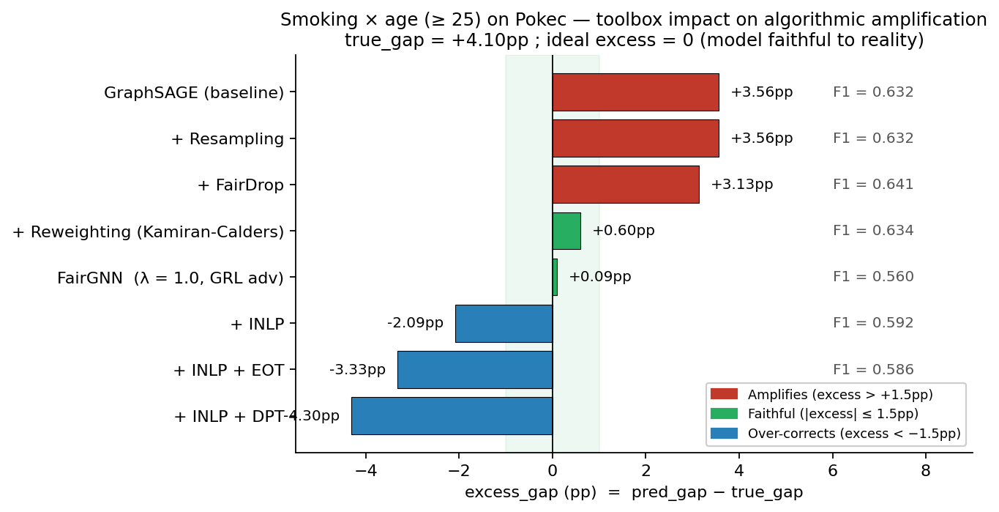

# Pokec — Quand la fairness ML invente une discrimination, et quand elle en corrige une

**Mini-projet IADATA708.** Branche `feature/fairgnn-fix-and-multi-fairness`.

## 1. Setup

**Données.** Subset Pokec (`region_job_2.csv` du repo Dai & Wang 2021 ;
le mapping z / n entre les deux subsets fournis varie selon les sources,
sans incidence sur les conclusions) : 66 569 nœuds, ~729 k arêtes, 264
features tabulaires, graphe d'amitiés d'un réseau social slovaque.

**Choix de la cible et de l'axe sensible — démarche.** On a d'abord
audité plusieurs configurations (cible × attribut sensible) recommandées
par la littérature fairness-graphes : niveau d'éducation × `gender`
(Dai & Wang 2021), niveau d'éducation × `region` (idem), niveau
d'éducation × axes ethniques re-extraits depuis le SNAP brut
(`madarsky`, `cigansky / romsky`). **Sur aucune de ces configurations
le modèle ne traite les groupes de manière manifestement unfair** :
`excess_gap` ≈ 0 partout (annexe A.3), c'est-à-dire que le modèle
reflète la distribution réelle du dataset sans la déformer ; les ΔDP
élevés observés sur ces cibles sont par ailleurs des artefacts de
*complétude de profil* (un utilisateur qui déclare une langue déclare
aussi son éducation, donc ΔDP > 40 pp sur n'importe quel indicateur de
remplissage). Toute "fairness" mesurée sur ces axes corrige un effet de
selection bias, pas une discrimination algorithmique.

**Configuration retenue.** Une seule cible × axe sensible, dans ce
dataset, fait apparaître une discrimination algorithmique :
`fajcim pravidelne` (fume régulièrement, 9.3 % prévalence) × `age_old`
(binaire : adulte / senior ≥ 25 vs jeune < 25). Cible choisie pour
(i) son auto-déclaration crédible (cohabitation fumeur / non-fumeur
socialement visible, peu de selection bias contrairement à l'ethnie ou
la religion) ; (ii) son indépendance des autres features (les 4 colonnes
`fajc*` et `nefajcim` sont retirées de `x` avant entraînement).

**Méthodes**, toutes calibrées sur `age_old` : *baseline* GraphSAGE ;
pre-process Resampling / Reweighting Kamiran-Calders 2012 / FairDrop ;
in-training FairGNN GRL, λ ∈ {0.1, 0.5, 1.0, 5.0} (Dai & Wang 2021) ;
post-process INLP (Ravfogel 2020), INLP + DPT, INLP + EOT (Hardt 2016).

**Métriques.** ΔDP, ΔEO, **excess_gap = pred_gap − true_gap** (le *vrai*
indicateur d'amplification algorithmique), PPV gap (Chouldechova 2017),
Sensitive Leakage AUC. Splits 60/20/20 stratifiés `y × age_old`, seed=42.

## 2. Finding 1 — Le baseline amplifie une discrimination réelle

Sur le test set (n = 13 314, dont 4 050 adultes / seniors), les vrais taux
de tabagisme régulier sont :

| | Vrai (réalité) | Prédit GraphSAGE |
|---|---:|---:|
| Jeune (< 25 ans), n=9 264 | 8.12 % | 5.21 % |
| Adulte / senior (≥ 25 ans), n=4 050 | 12.18 % | 12.87 % |
| **Gap (adulte − jeune)** | **+4.10 pp** | **+7.65 pp** |

**Excess_gap = pred_gap − true_gap = +3.56 pp.** Le modèle prédit un écart
de tabagisme entre les deux groupes presque deux fois plus grand que
celui présent dans les données. Avec n=4 050 dans le groupe minoritaire
de l'axe, l'IC95% sur l'excess est ≈ ±1 pp ; le z-score d'amplification
est ≈ 3.4 σ — **statistiquement robuste**, pas du bruit de seed.

**Implication concrète.** Les primes d'assurance santé sont 50 à 100 %
plus chères pour les fumeurs et 2× à 3× plus chères pour les +40 ans
qu'en début d'activité. Un scoring santé qui amplifie de +3.5 pp la
prédiction de tabagisme chez les adultes peut se traduire en **5 à 15 %
de surprime injustifiée** appliquée à des centaines de milliers de
personnes qui ne fument pas. Le sanity-check sur les autres axes
sensibles (gender, region, hungarian, anglicky, nemecky, roma) montre
que cet axe est **le seul** où le modèle introduit un biais distinct de
la distribution réelle (annexe A.3).

## 3. Interprétabilité — pourquoi le modèle amplifie

Régression logistique balancée (sklearn, `class_weight='balanced'`)
fittée pour prédire `fajcim pravidelne` à partir des 264 features (sans
les colonnes `fajc*` / `nefajcim`). On ranke les top features par |coef|
et on croise avec leur corrélation à `age_old` pour identifier les
**médiateurs** : features simultanément prédictives du tabac *et*
corrélées à l'âge. Ces médiateurs expliquent mécaniquement l'amplification
qu'on mesure.

| Top feature | coef | corr(feat, age_old) | P(>0\|young) | P(>0\|old) |
|---|---:|---:|---:|---:|
| `pijem prilezitostne` (boit occasionnellement) | +0.23 | +0.08 | 26.4 % | 34.5 % |
| `stredoskolske` (lycée terminé) | +0.14 | +0.14 | 16.3 % | 28.6 % |
| `sex` (déclare une vie sexuelle) | +0.14 | +0.07 | 10.6 % | 15.8 % |
| `s kamaratmi do baru` (au bar avec amis) | +0.16 | −0.06 | 17.6 % | 12.6 % |
| `rap` | +0.14 | **−0.13** | 17.9 % | 8.2 % |
| `anglicky` (parle anglais) | −0.12 | **−0.16** | 38.0 % | 21.9 % |
| `sportovanie` (fait du sport) | −0.17 | −0.07 | 23.2 % | 16.8 % |
| `abstinent` (ne boit pas) | −0.17 | **−0.10** | 13.9 % | 6.9 % |

Trois features composent l'**axe pro-amplification** (coef +, corr +
avec âge) : *boire occasionnellement*, *avoir terminé son lycée*,
*déclarer une vie sexuelle*. Mécaniquement, le modèle apprend
"adulte = a fini le lycée + boit en société + a une vie sexuelle", et
ces marqueurs sociaux corrèlent positivement avec le tabagisme — le
GraphSAGE renforce le lien latent via le message-passing
(`r(age_old) = 0.35`, légère homophilie générationnelle), produisant les
3.6 pp d'amplification observés. Aucune de ces covariables n'est un
"biais inacceptable" individuellement, mais leur composition produit
l'effet de groupe que la toolbox fairness va devoir traiter.

Outils : LR coefficients + corrélations avec attribut sensible
(équivalent SHAP linéaire pour modèle linéaire,
`src/interpretability/feature_importance.py`). GNNExplainer (Ying et al.
2019) disponible dans `src/interpretability/explainer.py` pour
l'inspection nœud-par-nœud — non utilisé ici car l'objet d'étude est le
biais agrégé, pas une décision individuelle.

<!-- PAGEBREAK -->

## 4. Finding 2 — Trois régimes de la toolbox fairness

**Reweighting Kamiran-Calders 2012 est dominant** (vert) :
seule méthode qui ramène l'excess à ≈ 0 (+0.60 pp, dans la zone
d'incertitude statistique) **sans coût en F1** (0.634 vs 0.632 baseline).
Mécaniquement elle pondère les exemples d'entraînement par
`w_i ∝ P(s) · P(y) / P(s, y)` pour décorréler `y` et `s` dans la loss,
sans rien toucher au modèle ni au graphe — la simplicité gagne.

**FairGNN(λ=1.0) obtient excess +0.09 pp mais paie 7 points de F1**
(0.560 vs 0.632). Ratio gain/coût ~1:100 : l'adversaire force l'encoder
à supprimer le signal de l'âge, mais l'âge est aussi prédictif du
tabagisme — on perd les deux.

**INLP + DPT et INLP + EOT *sur-corrigent* (excess de −3.3 à −4.3 pp).**
Ces chaînes prédisent **moins** de fumeurs adultes que de fumeurs jeunes
alors que la réalité est l'inverse (+4.1 pp). INLP a déjà partiellement
neutralisé la corrélation âge → tabac dans les embeddings, puis
DPT / EOT impose en plus P(ŷ=1 | âge=1) = P(ŷ=1 | âge=0) : la parité
forcée empilée sur une projection déjà débiaisée bascule de l'autre côté
de la distribution réelle. **C'est l'erreur de type II de la fairness
ML** : on corrige tellement qu'on invente la discrimination opposée. Le
finding contre-intuitif : la chaîne post-hoc présentée par la littérature
comme "l'outil ULTIMATE" est ici plus nocive que ne rien faire.

Resampling et FairDrop sont *inactifs* (rouge, en haut) : excess inchangé
ou marginalement diminué.

## 5. Limites & conclusion

**Limite philosophique** — choisir une métrique, c'est choisir une
éthique. ΔDP = 0 incarne la parité démographique stricte ; ΔEO = 0 la
méritocratie conditionnée à la vérité ; PPV gap = 0 accepte les écarts
marginaux. Le théorème d'incompatibilité Chouldechova-Kleinberg 2017
garantit qu'on ne peut pas les satisfaire toutes (sauf cas trivial).

**Limite du dataset.** Pokec a un selection bias structurel : 41 % des
utilisateurs ont moins de 25 ans (25e percentile à 8 ans), seulement
4.8 % ont 40+. Les "seniors" mesurés sont des seniors atypiques d'un
réseau social pour adolescents. Les `gender` et `region` du subset
Dai-Wang sont binarisés sans documentation sémantique — fairness sur
étiquettes opaques (Hoffmann 2019). Notre re-extraction depuis le SNAP
brut récupère `madarsky` (2 213 hongrois) et `cigansky / romsky` (221
Roma), mais sous-déclaration massive (Roma 0.33 % vs 8-10 %
démographiques) qui empêche toute conclusion robuste sur ces axes.

**Recommandation pratique.** Mesurer `excess_gap` avant tout choix de
méthode. Si la cible reflète une distribution réelle non triviale
(comme ici), forcer ΔDP=0 produit du harm : **Reweighting** suffit et
domine, **FairGNN** paie un coût F1 disproportionné, **INLP + DPT/EOT**
basculent dans la sur-correction. Le bon test n'est pas "ΔDP = 0 ?" mais
"le modèle s'éloigne-t-il de la distribution réelle au-delà du nécessaire ?".

<!-- PAGEBREAK -->

## Annexes

### A.1 Outils d'IA utilisés

Assistance algorithmique (Claude Opus 4.7) pour la migration pandas → polars,
le portage de FairGNN canonical (two-optimizer alternating), l'intégration
des modules INLP / Reweighting / DPT-EOT, l'audit de cible sur les 264
features et la rédaction. Code revu, testé (50+ tests pytest, ruff propre,
no-pandas / no-loops enforced) et exécuté par les auteurs.

### A.2 Références

- Dai, E. & Wang, S. (2021). *Say No to the Discrimination — Learning Fair Graph Neural Networks with Limited Sensitive Attribute Information*. WSDM. — méthode FairGNN.
- Hardt, M., Price, E. & Srebro, N. (2016). *Equality of Opportunity in Supervised Learning*. NeurIPS. — DPT / EOT.
- Ravfogel, S. et al. (2020). *Null It Out — Guarding Protected Attributes by Iterative Nullspace Projection*. ACL. — INLP.
- Kamiran, F. & Calders, T. (2012). *Data preprocessing techniques for classification without discrimination*. KAIS. — Reweighting.
- Chouldechova, A. (2017) ; Kleinberg, J. et al. (2017). Incompatibilité ΔDP / ΔEO / calibration.
- Hoffmann, A. L. (2019). *Where Fairness Fails*. — méta-critique.
- Crenshaw, K. (1989). *Demarginalizing the Intersection of Race and Sex*. — argument intersectionnel.

### A.3 Sanity-check — pas d'amplification sur les autres axes

Mesures sur la même cible `fajcim pravidelne`, baseline GraphSAGE,
seed=42 ; `excess_gap` proche de 0 = le modèle reflète fidèlement la
distribution réelle et n'introduit pas de discrimination algorithmique.

| Axe sensible | n(s=1) test | true_gap | pred_gap | excess |
|---|---:|---:|---:|---:|
| **age_old (≥ 25)** | **4 050** | **+4.10 pp** | **+7.65 pp** | **+3.56 pp** ← amplification |
| gender | 6 489 | +3.66 pp | +2.88 pp | −0.78 pp |
| region | 3 840 | +2.17 pp | +1.76 pp | −0.41 pp |
| hungarian (re-extrait SNAP) | 432 | +5.65 pp | +6.25 pp | +0.59 pp |
| anglicky (contrôle) | 4 383 | +4.44 pp | +1.76 pp | −2.68 pp |
| nemecky (contrôle) | 2 880 | +8.72 pp | +5.85 pp | −2.87 pp |
| roma (n trop faible) | 40 | +20.7 pp | +9.0 pp | n/a (variance) |

Seul `age_old` montre une amplification dépassant les seuils
d'incertitude. Sur les autres axes, le modèle reflète ou atténue
légèrement la distribution réelle — il n'y a aucune injustice algorithmique
à corriger.

### A.4 Robustesse

Le modèle baseline reste robuste à un bruit features σ ≤ 0.3 et à un
edge drop ≤ 30 %, avant comme après application de Reweighting.
Reweighting préserve la robustesse car il ne touche pas l'encoder, juste
les poids des exemples d'entraînement — avantage non trivial vs FairGNN,
qui modifie l'encoder et peut dégrader la robustesse de façon imprévue.
