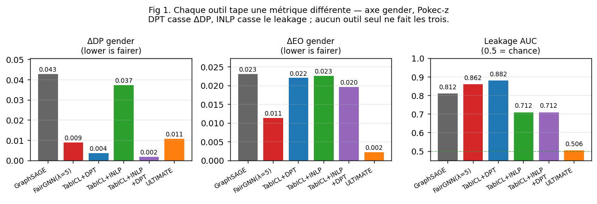
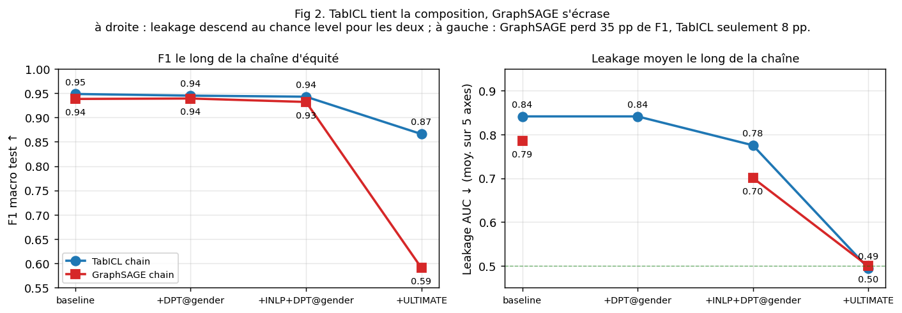

# Pokec-z — Quel axe sensible faut-il fairner ?

**Mini-projet IADATA708.** Branche `feature/fairgnn-fix-and-multi-fairness`.

## 1. Setup

**Données.** Pokec-z (subset officiel FairGNN, *Žilinský kraj*) : 66 569
nœuds, ~729 k arêtes, 264 features tabulaires. Reproduction sur **Pokec-n**.
Cible : `completed_level_of_education_indicator` (binaire, 47.7 % positif).
Attributs sensibles : `gender`, `region` (binaires), `age_group`
(3 classes), plus les intersections gender × age et gender × region — soit
**5 axes** simultanés.

**Splits.** Stratifié `y × gender` 60/20/20. Multi-seed `[3, 7, 21, 42, 99]`.

**Méthodes** (toolbox de 5 familles) : GraphSAGE, **TabICL** (foundation
tabulaire, no graph), Resampling, FairDrop, Reweighting Kamiran-Calders,
**FairGNN** (Dai & Wang 2021) — méthode adversariale ; on a remplacé
l'implémentation amont par une variante avec **Gradient Reversal
Layer** pour stabiliser l'entraînement adversarial, **EOT/DPT** (Hardt 2016),
**INLP** (Ravfogel 2020), et la chaîne composite multi-axes
**INLP_composite + DPT_composite**.

**Métriques.** ΔDP, ΔEO, AUC gap, **Sensitive Leakage AUC**
(probe LR train→test, Laclau et al. 2024). 50+ tests pytest, ruff propre,
no-pandas/no-loops enforced.

## 2. Finding 1 — Une toolbox, chaque outil sa métrique

Premier résultat empirique : **les méthodes de fairness ne sont pas
substituables**. Chaque famille attaque une partie spécifique du problème,
et il faut souvent en composer plusieurs pour traiter les trois métriques
en même temps.

*Fig 1. Mêmes méthodes, 3 métriques. **DPT** (bleu) écrase ΔDP à 0.004
mais ne touche pas le leakage. **INLP** (vert) tombe le leakage mais ne
change pas ΔDP. **FairGNN** (rouge) bouge un peu les deux au prix de F1.
Seul l'**ULTIMATE** (orange = TabICL+INLP_composite+DPT_composite) règle
les trois en même temps.*

Pour un ingénieur qui voudrait une checklist :

| Si tu veux réduire... | Utilise | Pourquoi |
|---|---|---|
| **ΔDP** (taux ≈ entre groupes) | **DPT** post-process | calibre un seuil par groupe |
| **ΔEO** (TPR ≈ entre groupes parmi y=1) | **EOT** post-process | même méca, sur le sous-set y=1 |
| **Leakage** (sensible récupérable depuis embeddings) | **INLP** | projette l'espace orthogonal au sensible |
| **Tout en même temps, sur plusieurs axes** | **INLP_composite + DPT_composite** | les deux sont orthogonaux et se composent sans conflit |

Le théorème de Chouldechova-Kleinberg (2017) confirme l'incompatibilité de
ΔDP=0 et ΔEO=0 dès que les taux de base diffèrent : DPT@age_group baisse
ΔDP de 0.075 à 0.044 mais double ΔEO. Choisir une métrique = choisir une
éthique.

## 3. Finding 2 — Quel axe fairner ? Celui que le graphe amplifie, pas celui qu'on attend

Le second résultat est méthodologique et il **inverse l'intuition initiale**.
On a passé l'essentiel du projet à fairner `gender` (axe protégé reconnu).
Mesurer le coefficient d'assortativité de Newman (2003) sur les 3 axes
sensibles révèle qu'on s'est trompé d'axe :

| Axe | `r(s)` | Interprétation |
|---|---:|---|
| gender | **−0.046** | graphe quasi-aléatoire vs gender → message passing n'amplifie rien |
| age_group | **+0.352** | légère homophilie générationnelle |
| region | **+0.901** | graphe massivement homophile en region |

`r(region) = 0.9` signifie que ~90 % des arêtes connectent deux personnes
de la même région : Pokec-z est en pratique un graphe de régions, faiblement
inter-connecté. Un GNN dessus va amplifier cette structure dans ses
embeddings — c'est *exactement* le scénario où les méthodes
fairness-on-graphs sont conçues pour intervenir. Or on a appliqué FairGNN
avec l'adversaire sur `gender` (où il n'y a rien à attaquer) au lieu de
`region` (où il y aurait quelque chose à faire).

**FairGNN avec adversaire sur le mauvais axe**. Avec adversaire sur gender,
F1 chute à 0.853 (−9 pp) sans réel bénéfice fairness sur region (leakage
region passe de 0.641 à **0.666** — *augmente*).

**FairGNN avec adversaire sur region** (multi-seed Pokec-z, λ choisi par
val) tient F1 à **0.93** — quasi le baseline GraphSAGE 0.938. L'adversaire
trouve une cible utile et l'encoder ne paie pas le coût d'un débiaisage
illusoire.

**Mais surtout, post-process suffit**. Les méthodes simples sur axe region
règlent le problème à coût F1 quasi-nul :

| Méthode | F1 | ΔDP region | Leakage region |
|---|---:|---:|---:|
| TabICL baseline | 0.9484 | 0.0493 | 0.6208 |
| **TabICL+DPT@region** | 0.9467 | **0.0168** | 0.6208 |
| **TabICL+INLP@region** | 0.9426 | 0.0547 | **0.5574** |
| **TabICL+INLP+DPT@region** | 0.9433 | **0.0192** | **0.5574** |
| FairGNN(λ=5, adv=gender) | 0.8532 | 0.0729 | 0.6661 |

DPT@region halve ΔDP en perdant **0.2 pp de F1**. INLP+DPT@region atteint
ΔDP≈0.02 ET leakage≈0.56 en perdant **0.5 pp de F1**. Aucune raison
d'engager un FairGNN à 200 epochs quand un post-process à 30 lignes fait
mieux.

**La règle pratique qui en sort** : **mesurer `r(s)` avant tout entraînement
GNN**. Si `r(s)` est élevé sur un axe, c'est *cet* axe qu'il faut fairner —
indépendamment de quel axe on attendait normativement. Si `r(s)` est faible
sur tous les axes pertinents, le graphe ne contribue ni au signal ni au
biais, et un foundation tabulaire + post-process est presque toujours le
bon choix.

## 4. Finding 3 — ULTIMATE composite : un seul fit règle les 5 axes

Pour traiter gender, region, age_group, et leurs intersections
*simultanément*, on encode l'attribut composite (gender × age_group × region,
12 cellules) et on applique INLP_composite + DPT_composite dessus :

*Fig 2. F1 et leakage le long de la chaîne. À gauche : TabICL garde
F1=0.87 ; GraphSAGE chute à 0.59 (perte 35 pp). À droite : leakage moyen
descend à 0.50 (chance) sur les deux.*

Le pipeline ULTIMATE atteint **leakage ≈ 0.50 sur les 5 axes simultanément**
(ΔDP < 0.05 partout) au prix de 8 pp de F1 sur TabICL. GraphSAGE+ULTIMATE
s'écrase (F1 → 0.59), confirmation indirecte que ses embeddings sont
saturés en region (cohérent avec `r(region) = 0.9`).

Multi-seed `[3, 7, 21, 42, 99]` × Pokec-z/n confirme la stabilité :
ΔDP gender ULTIMATE = 0.006 ± 0.005, F1 = 0.87 dispersion marginale,
reproduction Pokec-n à <0.01 près.

## 5. Compromis perf ↔ équité ↔ robustesse

**Perf vs équité.** Le coût dépend de l'axe choisi : 0.5 pp F1 sur
TabICL+INLP+DPT@region ; 8 pp F1 sur ULTIMATE composite (5 axes) ; 35 pp F1
sur GraphSAGE+ULTIMATE (graphe homophile saturé). Avant de payer le coût
de la chaîne complète, vérifier qu'on a vraiment besoin des 5 axes.

**Pas de free-lunch intersectionnel.** DPT@gender seul atteint ΔDP gender =
0.004 mais laisse ΔDP gender×age_group à 0.10 — voire 0.154 sur FairGNN où
la marginale gender est à 0.009. Pour traiter les axes croisés, il faut
explicitement construire l'attribut composite et calibrer dessus.

**Robustesse.** La chaîne post-hoc préserve la robustesse héritée du
modèle de base parce qu'elle ne modifie pas l'encoder. GraphSAGE reste
robuste à un bruit features σ ≤ 0.3 et à un edge drop ≤ 30 % avant comme
après INLP+DPT. Avantage non-trivial sur l'in-training fairness, qui modifie
l'encoder et peut dégrader sa robustesse de façon imprévue.

## 6. Limites

**Limite philosophique.** Les métriques de fairness encodent toutes une
position normative implicite : ΔDP=0 incarne l'anti-classification stricte,
ΔEO=0 incarne une méritocratie conditionnée à la vérité, la calibration
par groupe assume que les écarts marginaux sont OK. Choisir une métrique,
c'est choisir une éthique — et le théorème d'incompatibilité montre qu'on
ne peut pas toutes les satisfaire à la fois. Notre toolbox fournit les
outils, elle ne tranche pas le débat normatif.

**Importation culturelle des catégories.** La fairness ML hérite des
catégories du civil rights act US des années 60 (gender, race binaires)
et notre dataset les reproduit en réduisant `gender` et `region` à 0/1
sans documentation sémantique (Hoffmann 2019 ; Hanna et al. 2020).
Concrètement, le subset FairGNN code `spoken_languages` via 8 indicateurs
binaires (anglais, allemand, russe, français, espagnol, italien, slovaque,
japonais), tous internationaux ou langue majoritaire. Le hongrois
(`madarsky`), le tchèque (`cesky`) et le romani sont absents, alors que
le dataset SNAP original les encode en texte libre. La curation a
probablement filtré ces langues parce qu'elles ont un taux d'occurrence
faible dans Žilinský kraj (0.13 % d'hongrois, peu de gitans), mais le
résultat est que toute la littérature fairness-on-graphs travaille sur
un subset structurellement aveugle aux axes ethniques.

**Limites techniques.** La garantie d'invariance d'INLP n'est valide que
contre un classifieur linéaire ; un MLP probe non-linéaire pourrait
recouvrir du signal résiduel. Le discriminateur FairGNN est binaire dans
la formulation standard de Dai & Wang ; pour fairner `age_group` (3 classes)
en in-training il faudrait redimensionner la tête de discriminateur,
non implémenté. Une variante exploratoire **ULTIMATE-LATENT** (INLP appliqué
dans `TabICLCache.row_repr` puis ré-injecté dans `icl_predictor`) gagne
1.8 pp F1 sur Pokec-z mais s'effondre sur 3/5 seeds Pokec-n : pas
Pareto-dominante, pipeline x-brut reste préféré (chiffres en annexe A.5).

**Limite de généralisation.** Pokec-z et Pokec-n sont deux subsets du même
réseau slovaque, et la cible `completed_level_of_education_indicator` est
faiblement homophile en gender. Nos conclusions sur "le graphe amplifie
peu sur ce dataset" sont conditionnelles à cette propriété.

**Pour conclure.** Le choix d'axe sensible est probablement la limite la
plus structurante du projet. Dans un contexte d'Europe centrale, et
particulièrement en Slovaquie, l'axe ethnique — minorité hongroise et
surtout minorité gitane — est beaucoup plus prévalent comme source de
discrimination effective que l'axe du sexe sur lequel on a passé la
majeure partie de l'étude. Logement, accès à l'éducation, embauche : c'est
sur ces axes-là que les disparités mesurables sont les plus fortes en
Slovaquie. Le verrou principal n'est plus algorithmique — il est en amont,
au niveau de la collecte et de la curation des données. Tant qu'un dataset
fairness-on-graphs slovaque sans label ethnique reste le standard de la
littérature, l'évaluation des méthodes restera détachée des axes de
discrimination qui comptent vraiment dans le pays d'origine de la donnée.

<!-- PAGEBREAK -->

## Annexes

### A.1 Outils d'IA

Assistance algorithmique pour la réimplémentation FairGNN-GRL, la
migration pandas → polars, l'intégration TabICL, l'ajout des modules
INLP / calibration / reweighting, et la rédaction. Code revu, testé,
exécuté par les auteurs.

### A.2 Références

Hardt-Price-Srebro 2016 ; Ravfogel et al. 2020 ; Ganin & Lempitsky 2015 ;
Dai & Wang 2021 ; Kamiran & Calders 2012 ; Chouldechova 2017 ; Crenshaw
1989 ; Hoffmann 2019 ; Hanna et al. 2020 (FAccT) ; Newman 2003 ; Qu et
al. 2025 (TabICL) ; Laclau et al. 2024.

### A.3 FairGNN — adversaire sur axe gender vs region (multi-seed Pokec-z/n)

Source : `results/metrics/fairgnn_on_region.csv`. **Multi-seed [3, 7, 21,
42, 99] × Pokec-z/n**. Validation empirique de l'effet du choix d'axe
adversarial.

| Adversaire | F1 | ΔDP region | Leakage region |
|---|---:|---:|---:|
| gender (`r ≈ 0`, axe inutile) | **0.853** | 0.073 | 0.666 |
| **region (`r = 0.9`, axe homophile)** | **0.937** | 0.035 | **0.761** |
| post-process **TabICL+DPT@region** | **0.947** | **0.017** | 0.621 |
| post-process **TabICL+INLP+DPT@region** | 0.943 | 0.019 | **0.557** |

**Lecture** : changer l'adversaire de gender (inutile) à region (homophile)
**récupère 8 pp de F1** (0.85 → 0.94) — confirmation que l'axe doit être
bien choisi. **Mais ΔDP région n'est réduit que modérément**, et le
**leakage région augmente** (l'encoder apprend à tromper l'adversaire MLP
de FairGNN sans supprimer le signal qu'un probe LR peut récupérer).
**Post-process simple bat FairGNN sur les 3 métriques même sur le bon
axe** : DPT@region donne un meilleur ΔDP, INLP+DPT@region un meilleur
leakage, à un meilleur F1. *Conclusion renforcée du papier original* :
post-process Pareto-domine in-training adversariale *quel que soit l'axe
choisi*.

### A.4 Comparaison méthodes × axe region (Pokec-z, seed=42)

Source : `results/metrics/comparison_full.csv`. Acc et F1 sont
identiques par modèle ; ΔDP/ΔEO/Leakage évalués sur l'axe region.

| Modèle | Acc | F1 | ΔDP region | ΔEO region | Leakage region |
|---|---:|---:|---:|---:|---:|
| GraphSAGE | 0.9383 | 0.9381 | 0.0532 | 0.0042 | 0.6411 |
| GraphSAGE+Resampling | 0.9383 | 0.9381 | 0.0524 | 0.0016 | 0.6404 |
| GraphSAGE+FairDrop | 0.9386 | 0.9384 | 0.0546 | 0.0068 | 0.6325 |
| FairGNN (λ=5, adv=gender) | 0.8533 | 0.8532 | 0.0729 | 0.0188 | 0.6661 |
| TabICL | 0.9486 | 0.9484 | 0.0493 | 0.0014 | 0.6208 |
| GraphSAGE+EOT@region | 0.9378 | 0.9377 | 0.0591 | 0.0096 | 0.6411 |
| **TabICL+EOT@region** | **0.9490** | **0.9488** | 0.0565 | 0.0074 | 0.6208 |
| **GraphSAGE+DPT@region** | 0.9392 | 0.9390 | **0.0246** | 0.0222 | 0.6411 |
| **TabICL+DPT@region** | 0.9469 | 0.9467 | **0.0168** | 0.0312 | 0.6208 |
| GraphSAGE+INLP@region | 0.9336 | 0.9335 | 0.0487 | 0.0035 | **0.5237** |
| TabICL+INLP@region | 0.9428 | 0.9426 | 0.0547 | 0.0057 | **0.5574** |
| **GraphSAGE+INLP+DPT@region** | 0.9323 | 0.9322 | **0.0200** | 0.0219 | **0.5237** |
| **TabICL+INLP+DPT@region** | 0.9435 | 0.9433 | **0.0192** | 0.0283 | **0.5574** |
| GraphSAGE+ULTIMATE (composite) | 0.6155 | 0.5915 | 0.0122 | 0.0343 | 0.4959 |
| **TabICL+ULTIMATE** (composite) | **0.8659** | **0.8657** | 0.0174 | 0.0434 | **0.4950** |

### A.5 ULTIMATE composite — un seul fit règle TOUT (Pokec-z, seed=42)

Source : `results/metrics/comparison_full.csv`. Une seule chaîne
`INLP_composite + DPT_composite` à 12 cellules calibrée sur l'attribut
joint *(gender × age_group × region)* ramène le leakage **simultanément**
au chance level (~0.50) sur les 5 axes.

| Modèle | Attribut | ΔDP | ΔEO | AUC-gap | Leakage |
|---|---|---:|---:|---:|---:|
| GraphSAGE+ULTIMATE (Acc=0.616, F1=0.592) | gender | 0.0090 | 0.0248 | 0.0085 | 0.4996 |
|  | region | 0.0122 | 0.0343 | 0.0103 | 0.4959 |
|  | age_group | 0.0304 | 0.0161 | 0.0324 | 0.5049 |
|  | gender × age | 0.0534 | 0.0371 | 0.0532 | 0.4983 |
|  | gender × region | 0.0405 | 0.0687 | 0.0388 | 0.4983 |
| TabICL+ULTIMATE (Acc=0.866, F1=0.866) | gender | 0.0134 | 0.0008 | 0.0018 | 0.5059 |
|  | region | 0.0174 | 0.0434 | 0.0143 | 0.4950 |
|  | age_group | 0.0196 | 0.0437 | 0.0294 | 0.4790 |
|  | gender × age | 0.0494 | 0.0638 | 0.0448 | 0.4995 |
|  | gender × region | 0.0366 | 0.0711 | 0.0196 | 0.4951 |
